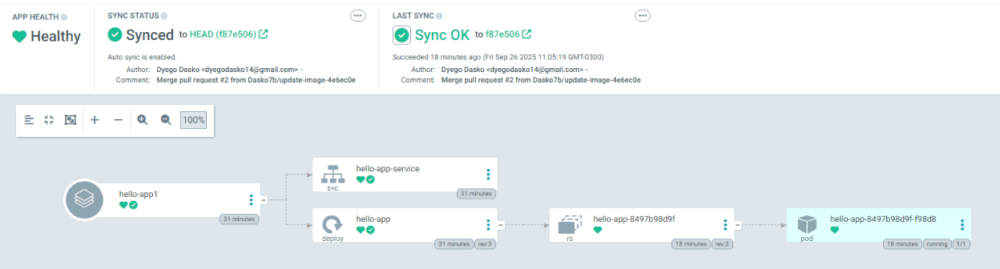

# Projeto: Pipeline CI/CD com GitHub Actions, ArgoCD e FastAPI

Este projeto demonstra a automação do ciclo completo de desenvolvimento, build, deploy e execução de uma aplicação web simples em FastAPI. O objetivo é implementar um fluxo de trabalho de CI/CD (Integração Contínua e Entrega Contínua) robusto, garantindo entregas de código com velocidade, segurança e consistência.

A metodologia utilizada é o **GitOps**, onde o repositório Git atua como a única "fonte da verdade" para a infraestrutura e os deploys no Kubernetes.

## Tecnologias Utilizadas

* **Aplicação:** Python com FastAPI
* **Containerização:** Docker & Docker Hub
* **Orquestração:** Kubernetes
* **Ambiente Local K8s:** Rancher Desktop
* **CI/CD (Automação):** GitHub Actions
* **Entrega Contínua (GitOps):** ArgoCD
* **Controle de Versão:** Git & GitHub

## Pré-requisitos

Para replicar este ambiente, é necessário ter:
* Conta no GitHub (repositório público)
* Conta no Docker Hub com um token de acesso
* Rancher Desktop com Kubernetes habilitado
* `kubectl` configurado corretamente para acessar o cluster
* ArgoCD instalado no cluster local
* Git, Python 3 e Docker instalados localmente

## Arquitetura do Projeto

O projeto é estruturado em dois repositórios Git distintos para seguir as melhores práticas de GitOps:

1.  **`hello-app` (Repositório da Aplicação):**
    * Contém o código-fonte da aplicação FastAPI (`main.py`).
    * Inclui o `Dockerfile` para construir a imagem da aplicação.
    * Armazena o workflow do GitHub Actions (`.github/workflows/ci-cd.yaml`) que automatiza o processo de CI.
    **Nota:** Não esquece de definir os secrets no seu GitHub.

2.  **`hello-manifests` (Repositório de Manifestos):**
    * Contém os manifestos Kubernetes (`deployment.yaml` e `service.yaml`) que descrevem o estado desejado da aplicação no cluster.
    * Este repositório é monitorado pelo ArgoCD, que aplica qualquer alteração diretamente no ambiente.

## Fluxo do CI/CD

O processo automatizado funciona da seguinte maneira:

1.  **Commit & Push:** O desenvolvedor faz uma alteração no código da aplicação e envia (`git push`) para a branch `main` do repositório `hello-app`.

2.  **Disparo do GitHub Actions:** O push aciona automaticamente a pipeline de CI/CD definida no GitHub Actions.

3.  **Build & Push da Imagem:** A pipeline faz o build de uma nova imagem Docker da aplicação. A imagem é tagueada com o hash do commit para garantir versionamento e imutabilidade. Em seguida, a imagem é enviada para o Docker Hub.

4.  **Abertura de Pull Request (PR):** Após o envio da imagem, a pipeline clona o repositório `hello-manifests` e atualiza o arquivo `deployment.yaml`, alterando a tag da imagem para a nova versão recém-criada. Um Pull Request com essa alteração é aberto automaticamente no repositório de manifestos.

5.  **Aprovação e Merge:** Um responsável revisa o PullRequest e faz o merge para a branch `main` do `hello-manifests`. Este passo manual garante um controle sobre o que é liberado em produção.

6.  **Sincronização do ArgoCD:** O ArgoCD, que está constantemente monitorando o repositório `hello-manifests`, detecta a alteração na branch `main`.

7.  **Deploy Contínuo:** O ArgoCD inicia o processo de sincronização, comparando o estado desejado (definido nos manifestos do Git) com o estado atual do cluster. Ele atualiza o `Deployment`, fazendo com que o Kubernetes baixe a nova imagem do Docker Hub e atualize os pods da aplicação sem downtime (rolling update).

## Como Acessar a Aplicação

Para acessar a aplicação que está rodando no cluster Kubernetes local, utilize o `port-forward` do `kubectl`.

1.  Abra um terminal e execute o comando abaixo. Ele criará um túnel de comunicação entre sua máquina e o serviço no cluster.
    ```bash
    kubectl port-forward svc/hello-app-service 8080:8080
    ```
    Caso queria usar usar a aplicação junto com o argo CD rode na 8081:8080

    **Nota:** Mantenha este terminal aberto enquanto desejar acessar a aplicação.

2.  Abra seu navegador ou utilize `curl` para acessar o seguinte endereço:
    ```bash
    http://localhost:8080/
    ```

    A resposta esperada é a mensagem definida no arquivo `main.py`, como `{"message": "Hello World"}`.
    
    

    E no ArgoCD

    


## Autor

* Dyego Dasko